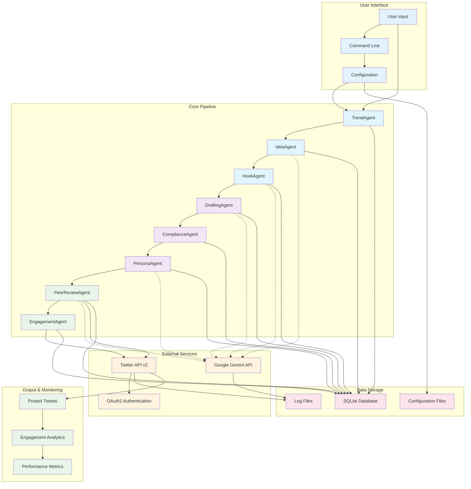
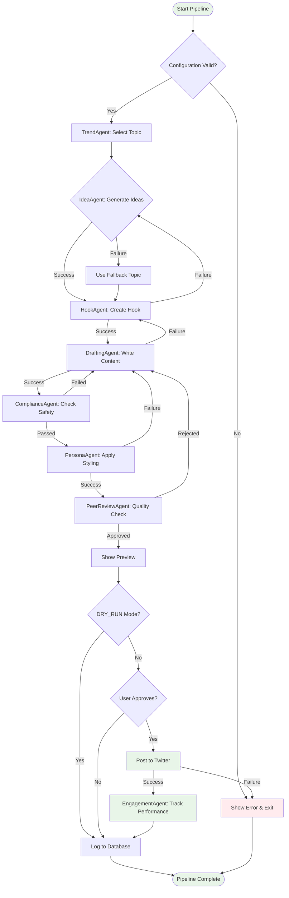
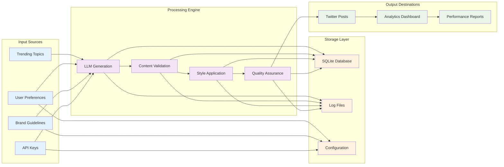
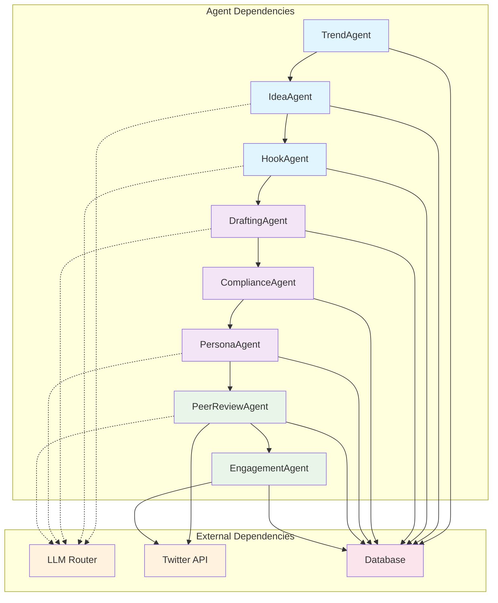
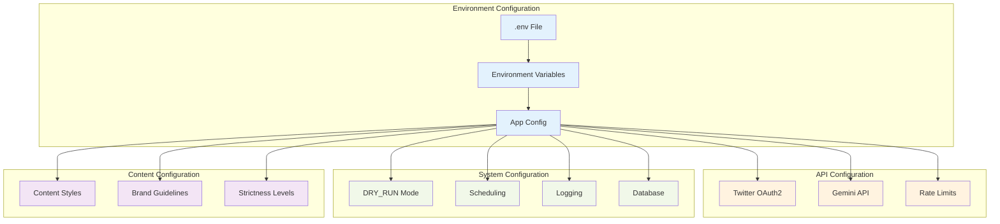
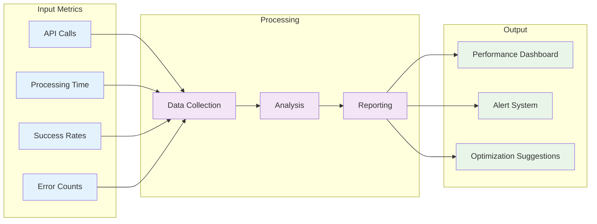
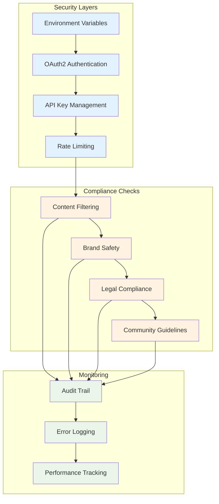

# Project Overview & Architecture

## 🏗️ Complete System Architecture

## 🔄 Complete Workflow

## 📊 Data Flow Architecture

## 🎯 Agent Interaction Matrix

## 🔧 Configuration Architecture

## 📈 Performance Monitoring

## 🛡️ Security & Compliance

---

*These diagrams provide a comprehensive visual understanding of the Twitter Automation Pipeline's architecture, workflow, and components.* 