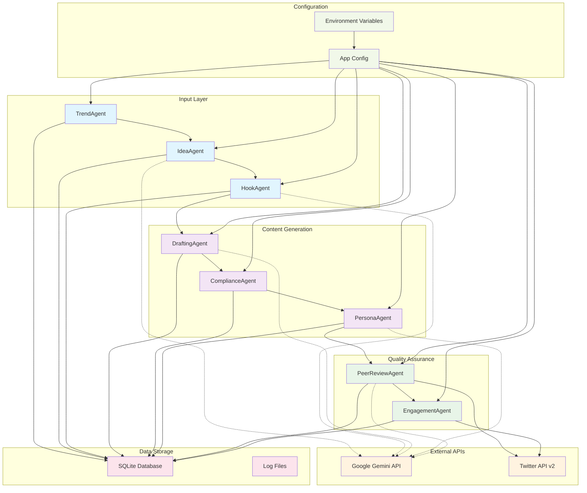
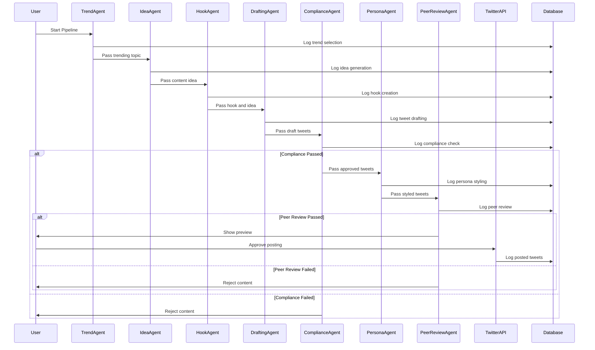
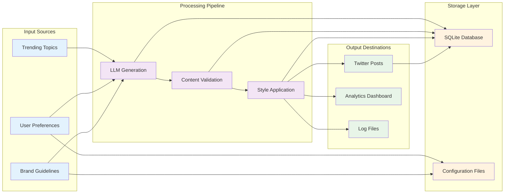

# System Architecture Diagram

## Complete Pipeline Flow

```mermaid
graph TB
    subgraph "Input Layer"
        A[TrendAgent] --> B[IdeaAgent]
        B --> C[HookAgent]
    end
    
    subgraph "Content Generation"
        C --> D[DraftingAgent]
        D --> E[ComplianceAgent]
        E --> F[PersonaAgent]
    end
    
    subgraph "Quality Assurance"
        F --> G[PeerReviewAgent]
        G --> H[EngagementAgent]
    end
    
    subgraph "External APIs"
        I[Google Gemini API]
        J[Twitter API v2]
    end
    
    subgraph "Data Storage"
        K[SQLite Database]
        L[Log Files]
    end
    
    subgraph "Configuration"
        M[Environment Variables]
        N[App Config]
    end
    
    %% Connections
    B -.-> I
    C -.-> I
    D -.-> I
    F -.-> I
    G -.-> I
    
    G --> J
    H --> J
    
    A --> K
    B --> K
    C --> K
    D --> K
    E --> K
    F --> K
    G --> K
    H --> K
    
    M --> N
    N --> A
    N --> B
    N --> C
    N --> D
    N --> E
    N --> F
    N --> G
    N --> H
    
    style A fill:#e1f5fe
    style B fill:#e1f5fe
    style C fill:#e1f5fe
    style D fill:#f3e5f5
    style E fill:#f3e5f5
    style F fill:#f3e5f5
    style G fill:#e8f5e8
    style H fill:#e8f5e8
    style I fill:#fff3e0
    style J fill:#fff3e0
    style K fill:#fce4ec
    style L fill:#fce4ec
    style M fill:#f1f8e9
    style N fill:#f1f8e9
```

## Agent Interaction Flow

```mermaid
sequenceDiagram
    participant User
    participant TrendAgent
    participant IdeaAgent
    participant HookAgent
    participant DraftingAgent
    participant ComplianceAgent
    participant PersonaAgent
    participant PeerReviewAgent
    participant TwitterAPI
    participant Database
    
    User->>TrendAgent: Start Pipeline
    TrendAgent->>Database: Log trend selection
    TrendAgent->>IdeaAgent: Pass trending topic
    
    IdeaAgent->>Database: Log idea generation
    IdeaAgent->>HookAgent: Pass content idea
    
    HookAgent->>Database: Log hook creation
    HookAgent->>DraftingAgent: Pass hook and idea
    
    DraftingAgent->>Database: Log tweet drafting
    DraftingAgent->>ComplianceAgent: Pass draft tweets
    
    ComplianceAgent->>Database: Log compliance check
    alt Compliance Passed
        ComplianceAgent->>PersonaAgent: Pass approved tweets
        PersonaAgent->>Database: Log persona styling
        PersonaAgent->>PeerReviewAgent: Pass styled tweets
        
        PeerReviewAgent->>Database: Log peer review
        alt Peer Review Passed
            PeerReviewAgent->>User: Show preview
            User->>TwitterAPI: Approve posting
            TwitterAPI->>Database: Log posted tweets
        else Peer Review Failed
            PeerReviewAgent->>User: Reject content
        end
    else Compliance Failed
        ComplianceAgent->>User: Reject content
    end
```

## Data Flow Architecture

```mermaid
graph LR
    subgraph "Input Sources"
        A[Trending Topics]
        B[User Preferences]
        C[Brand Guidelines]
    end
    
    subgraph "Processing Pipeline"
        D[LLM Generation]
        E[Content Validation]
        F[Style Application]
    end
    
    subgraph "Output Destinations"
        G[Twitter Posts]
        H[Analytics Dashboard]
        I[Log Files]
    end
    
    subgraph "Storage Layer"
        J[SQLite Database]
        K[Configuration Files]
    end
    
    A --> D
    B --> D
    C --> D
    
    D --> E
    E --> F
    F --> G
    F --> H
    F --> I
    
    D --> J
    E --> J
    F --> J
    G --> J
    
    B --> K
    C --> K
    
    style A fill:#e3f2fd
    style B fill:#e3f2fd
    style C fill:#e3f2fd
    style D fill:#f3e5f5
    style E fill:#f3e5f5
    style F fill:#f3e5f5
    style G fill:#e8f5e8
    style H fill:#e8f5e8
    style I fill:#e8f5e8
    style J fill:#fff3e0
    style K fill:#fff3e0
``` 