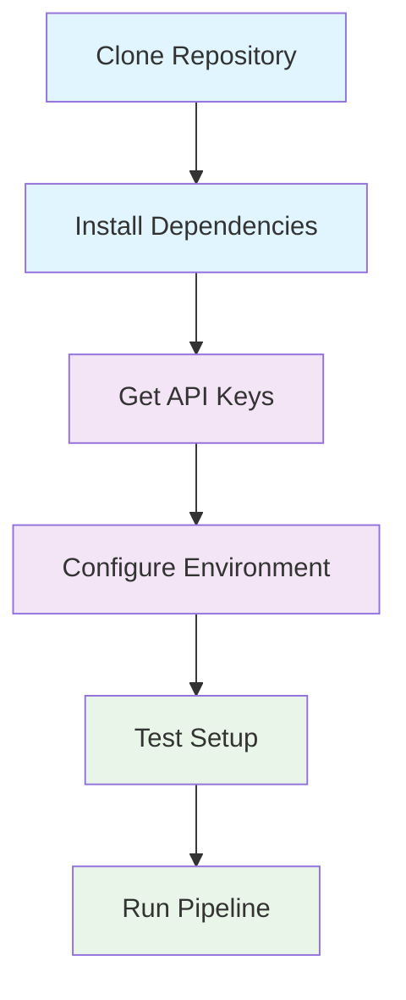
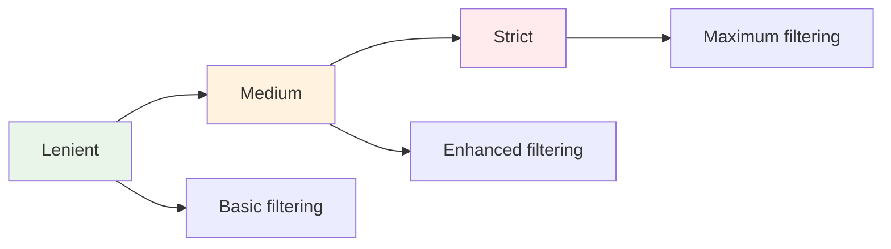

# Visual Setup Guide

A step-by-step visual guide to setting up the Twitter Automation Pipeline.

## 🎯 Quick Setup Overview



## 📋 Prerequisites Checklist

### **Required Software**
- ✅ Python 3.8 or higher
- ✅ Git
- ✅ Text editor (VS Code, Sublime, etc.)

### **Required Accounts**
- ✅ Twitter Developer Account
- ✅ Google AI Studio Account

### **System Requirements**
- ✅ 2GB RAM minimum
- ✅ 1GB free disk space
- ✅ Internet connection

## 🚀 Step-by-Step Setup

### **Step 1: Clone the Repository**

```bash
# Clone the repository
git clone https://github.com/TheHaywire/twitter-automation-pipeline.git

# Navigate to the project directory
cd twitter-automation-pipeline

# Verify the structure
ls -la
```

**Expected Output:**
```
total 248
drwxr-xr-x@ 21 user  staff    672 Jul 12 16:07 .
drwx------@ 29 user  staff    928 Jul 12 16:06 ..
-rw-r--r--@  1 user  staff   1230 Jul 12 16:06 .gitignore
-rw-r--r--@  1 user  staff  11893 Jul 12 12:49 API_DOCUMENTATION.md
-rw-r--r--@  1 user  staff   8627 Jul 12 12:55 CHANGELOG.md
-rw-r--r--@  1 user  staff   4605 Jul  9 15:35 GEMINI_TWITTER_AUTOMATION_PLAN.md
-rw-r--r--@  1 user  staff   1084 Jul 12 16:06 LICENSE
-rw-r--r--@  1 user  staff   2484 Jul 12 12:54 QUICK_REFERENCE.md
-rw-r--r--@  1 user  staff  11407 Jul 12 12:45 README.md
-rw-r--r--@  1 user  staff   4535 Jul 12 12:46 SETUP.md
drwxr-xr-x@ 13 user  staff    416 Jul 11 16:56 n8n_automation
-rw-r--r--@  1 user  staff    109 Jul 12 16:06 requirements.txt
```

### **Step 2: Install Dependencies**

```bash
# Install Python dependencies
pip install -r requirements.txt
```

**Expected Output:**
```
Collecting tweepy>=4.0.0
  Downloading tweepy-4.14.0-py3-none-any.whl (77 kB)
Collecting google-generativeai>=0.3.0
  Downloading google_generativeai-0.3.2-py3-none-any.whl (115 kB)
Collecting python-dotenv>=1.0.0
  Downloading python_dotenv-1.0.0-py3-none-any.whl (19 kB)
Collecting rich>=13.0.0
  Downloading rich-13.7.0-py3-none-any.whl (240 kB)
Installing collected packages: tweepy, google-generativeai, python-dotenv, rich
Successfully installed tweepy-4.14.0 google-generativeai-0.3.2 python-dotenv-1.0.0 rich-13.7.0
```

### **Step 3: Get API Keys**

#### **Twitter API Setup**

1. **Visit Twitter Developer Portal**
   ```
   🌐 https://developer.twitter.com/
   ```

2. **Create New App**
   ```
   📝 App Name: Twitter Automation Pipeline
   📝 Description: AI-powered Twitter content automation
   📝 Website: https://github.com/TheHaywire/twitter-automation-pipeline
   ```

3. **Get OAuth2 Credentials**
   ```
   🔑 Client ID: xxx
   🔑 Client Secret: xxx
   🔗 Redirect URI: http://127.0.0.1:8080/callback
   ```

#### **Google Gemini API Setup**

1. **Visit Google AI Studio**
   ```
   🌐 https://makersuite.google.com/app/apikey
   ```

2. **Create API Key**
   ```
   🔑 API Key: xxxx
   ```

### **Step 4: Configure Environment**

```bash
# Create .env file
touch .env

# Edit .env file with your credentials
nano .env
```

**Add the following content:**
```bash
# Twitter API Credentials
X_CLIENT_ID=your_twitter_client_id_here
X_CLIENT_SECRET=your_twitter_client_secret_here
X_REDIRECT_URI=http://127.0.0.1:8080/callback

# Google Gemini API
GEMINI_API_KEY=your_gemini_api_key_here
GEMINI_MODEL=gemini-2.5-flash

# System Configuration
DRY_RUN=true
SCHEDULE_TIMES=09:00,15:00,21:00
LOG_DB_PATH=logs/agentic_research.db
STRICTNESS=strict
```

### **Step 5: Test Configuration**

```bash
# Test configuration loading
python3 -c "from n8n_automation.app_config import Config; print('✅ Config loaded successfully')"

# Test LLM integration
python3 -c "from n8n_automation.llm.gemini import GeminiLLM; print('✅ LLM integration ready')"

# Test Twitter integration
python3 -c "from n8n_automation.integrations.twitter_api import TwitterAPI; print('✅ Twitter integration ready')"
```

**Expected Output:**
```
✅ Config loaded successfully
✅ LLM integration ready
✅ Twitter integration ready
```

### **Step 6: Run Test Pipeline**

```bash
# Run in DRY_RUN mode (safe testing)
python3 -m n8n_automation.app --once
```

**Expected Output:**
```
2025-07-12 12:34:43,509 INFO root Starting Twitter automation pipeline...
2025-07-12 12:34:43,512 INFO root Running agentic workflow...

===== TWEET/THREAD PREVIEW =====
Tweet 1: [Generated content here]

DRY_RUN is enabled. This tweet/thread would NOT be posted.

===== SUMMARY =====
Topic: [Selected topic]
Idea: [Generated idea]
Hook: [Created hook]
Tweets: [Generated tweets]

Pipeline Run Summary
[Table with agent results]
```

## 🔧 Configuration Options

### **Environment Variables Reference**

| Variable | Required | Default | Description |
|----------|----------|---------|-------------|
| `X_CLIENT_ID` | ✅ | - | Twitter OAuth2 client ID |
| `X_CLIENT_SECRET` | ✅ | - | Twitter OAuth2 client secret |
| `X_REDIRECT_URI` | ✅ | - | OAuth2 redirect URI |
| `GEMINI_API_KEY` | ✅ | - | Google Gemini API key |
| `GEMINI_MODEL` | ❌ | gemini-2.5-flash | LLM model name |
| `DRY_RUN` | ❌ | true | Test mode (true/false) |
| `SCHEDULE_TIMES` | ❌ | 09:00,15:00,21:00 | Posting schedule |
| `LOG_DB_PATH` | ❌ | logs/agentic_research.db | Database path |
| `STRICTNESS` | ❌ | strict | Content strictness |

### **Content Strictness Levels**



- **Lenient**: Basic content filtering
- **Medium**: Enhanced brand safety
- **Strict**: Maximum compliance checking

## 🎯 Production Setup

### **Enable Real Posting**

```bash
# Edit .env file
sed -i '' 's/DRY_RUN=true/DRY_RUN=false/' .env

# Run production pipeline
python3 -m n8n_automation.app --once
```

### **Scheduled Automation**

```bash
# Run scheduled automation
python3 -m n8n_automation.app

# The system will automatically post at configured times
# Default: 09:00, 15:00, 21:00 daily
```

## 🔍 Troubleshooting

### **Common Issues & Solutions**

#### **"GEMINI_API_KEY not set"**
```bash
# Check if .env file exists
ls -la .env

# Verify API key is set
grep GEMINI_API_KEY .env

# Test API key
python3 -c "from n8n_automation.llm.gemini import GeminiLLM; llm = GeminiLLM(); print('API key valid')"
```

#### **"Twitter authentication failed"**
```bash
# Check OAuth2 credentials
grep -E "X_CLIENT_ID|X_CLIENT_SECRET" .env

# Verify redirect URI
grep X_REDIRECT_URI .env

# Test Twitter API
python3 -c "from n8n_automation.integrations.twitter_api import TwitterAPI; api = TwitterAPI(); print('Twitter API initialized')"
```

#### **"Pipeline hangs on user input"**
```bash
# Enable DRY_RUN mode
echo "DRY_RUN=true" >> .env

# Or edit existing setting
sed -i '' 's/DRY_RUN=false/DRY_RUN=true/' .env
```

### **Verification Commands**

```bash
# Check all components
python3 -c "
from n8n_automation.app_config import Config
from n8n_automation.llm.gemini import GeminiLLM
from n8n_automation.integrations.twitter_api import TwitterAPI
print('✅ All components initialized successfully')
"

# Check database
sqlite3 logs/agentic_research.db "SELECT COUNT(*) FROM research_log;"

# Check logs
tail -f logs/app.log
```

## 📊 Setup Verification Checklist

- ✅ Repository cloned successfully
- ✅ Dependencies installed
- ✅ API keys obtained
- ✅ Environment configured
- ✅ Configuration tested
- ✅ Test pipeline run
- ✅ Database initialized
- ✅ Logging working
- ✅ Ready for production

## 🎉 Setup Complete!

Once you've completed all steps, your Twitter Automation Pipeline is ready to use!

**Next Steps:**
1. Review the generated content in DRY_RUN mode
2. Customize configuration as needed
3. Enable real posting when ready
4. Monitor performance and engagement

**Support:**
- 📖 README.md - Complete user guide
- 🔧 QUICK_REFERENCE.md - Essential commands
- 📄 API_DOCUMENTATION.md - Developer reference
- 🐛 GitHub Issues - Report problems

---

*This visual guide makes setup easy and ensures all components are properly configured.* 
